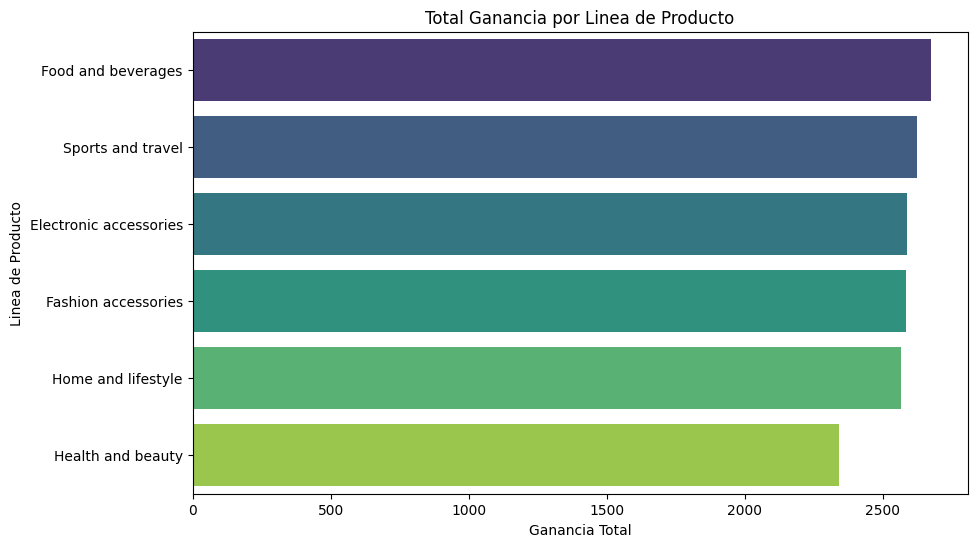
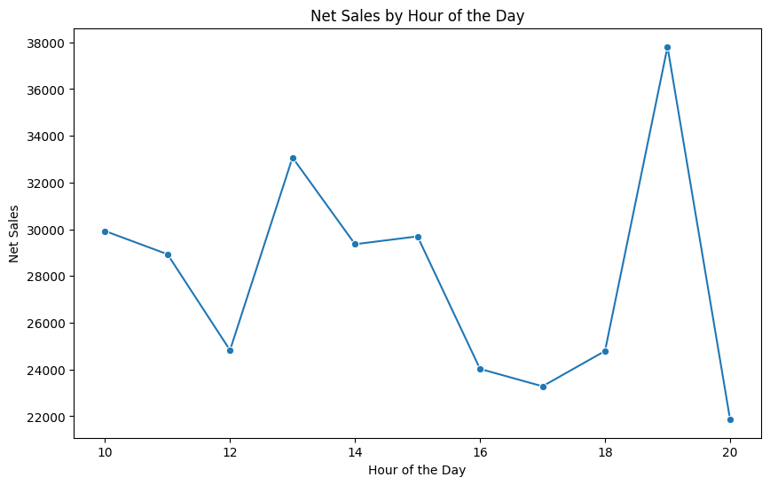
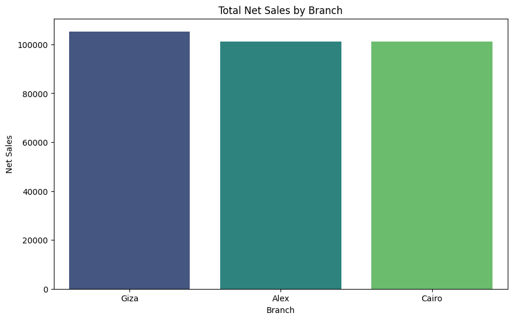
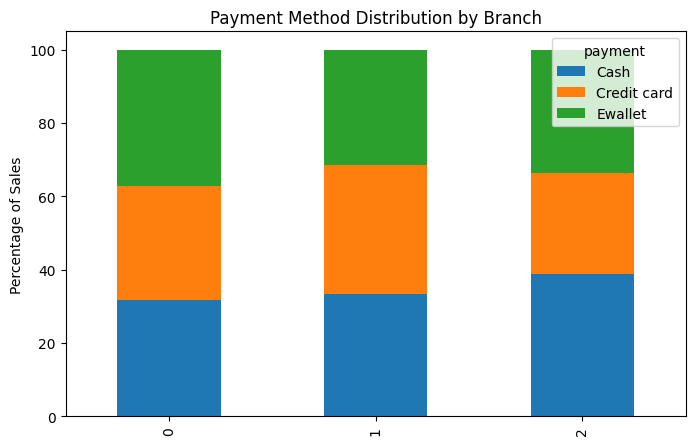

## 🛒 Supermarket Sales Analysis

### 📌 Problem Statement

This project analyzes supermarket transactional data to identify what truly drives business revenue; whether it is customer traffic, pricing, or client purchasing behavior.

 Retail businesses generate large volumes of transactional data every day, yet many organizations struggle on being able translate this data into actionable insights to improve business. For retail, understanding what drives revenue is critical for optimizing operations and improving profitability.

 The goal of this analysis is to answer the following business questions:

 * What factors drive total revenue in each branch?
 * Are sales differences caused by customer traffic, product mix, or pricing?
 * How do purchasing behaviors vary across locations?
 * Where are the opportunities to increase revenue without increasing operational costs?

### 📊 Dataset Description

 The dataset contains 1,000 transactions recorded across three supermarket branches:
 * Alex
 * Cairo
 * Giza

 Each record represents a purchased item and includes:
 Invoice ID
 Branch
 Product Line
 Unit Price
 Quantity
 Tax
 Total Sales
 Payment Method
 Date and Time
 The dataset allows analysis at both:
 * Transaction level
 * Item level

### 🧠 Methodology

The analysis followed a structured data analytics workflow:

1. Data Cleaning and Preparation
* Converted date and time fields into proper datetime format
* Extracted hour and day of week for temporal analysis
* Verified data consistency and uniqueness of invoice IDs

2. Exploratory Data Analysis (EDA)

Initial exploration focused on:
* Sales distribution by category
* Transaction frequency across branches
* Price and quantity relationships

3. Revenue Decomposition

Revenue was broken down into its core components:
* Revenue = Transactions × Items per Ticket × Average Price
* This allowed the analysis to determine which factor most strongly influenced sales performance across branches.

4. Ticket-Level Analysis

Metrics calculated:
* Average sales per ticket
* Average items per ticket
* Number of product categories per purchase

5. Branch Comparison

Branches were compared using:
* Total revenue
* Average ticket value
* Customer traffic
* Payment method distribution

6. Data Reshaping and Pivot Analysis

Pivot tables were used to:
* Analyze product category sales per branch
* Compare payment method usage across locations

### 📊 Sales by Product Category

Sales are evenly distributed across product categories, indicating a well-balanced product portfolio with no heavy reliance on a single category.

### ⏰ Sales by Hour

Sales activity peaks during early afternoon hours, suggesting critical operational windows for staffing, inventory availability, and checkout efficiency.

### 🏪 Sales by Branch

Although all branches generate similar total revenue, the underlying drivers differ significantly. Some branches rely on higher transaction volume, while others achieve similar results through higher ticket values.

### 💳 Payment Method Distribution

Payment preferences vary across branches, reflecting differences in customer behavior, local market conditions, and potential demographic factors.

### 📈 Key Performance Indicators (KPIs)

The following KPIs were derived:
* Total Revenue per Branch
* Average Ticket Size
* Transactions per Branch
* Items per Ticket
* Average Product Price
* Sales Distribution by Product Line
* Payment Method Share

### 🔍 Key Insights
1. Revenue is similar across branches, but driven by different factors

Giza achieved higher average ticket sizes, while Alex generated more transactions, resulting in comparable total revenue.

2. Ticket size is driven primarily by product price rather than quantity

The number of items per transaction remained consistent across branches, indicating that higher ticket values were due to higher-priced products rather than larger baskets.

3. Customer behavior differs by location

Payment method distribution and purchasing patterns varied across branches, suggesting differences in customer demographics or local market conditions.

4. Growth opportunity exists in ticket optimization

Since increasing customer traffic requires higher operational costs, improving ticket value through pricing strategy or product mix represents a more efficient revenue growth strategy.

## 💼 Business Impact

- Increasing ticket size is a more efficient growth strategy than    increasing traffic and costs less to the business.
- The individual branches require different strategies based on their customer behavior
- Pricing and product mix drive higher revenue, more than quantity does.

### 🧰 Tools and Technologies

Python

Pandas

Matplotlib

Jupyter Notebook
